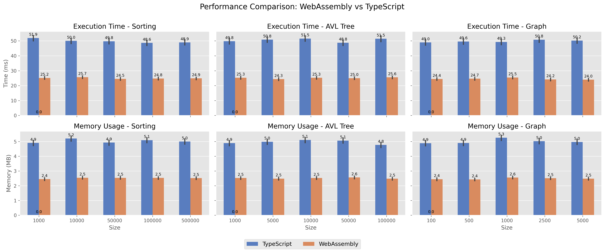
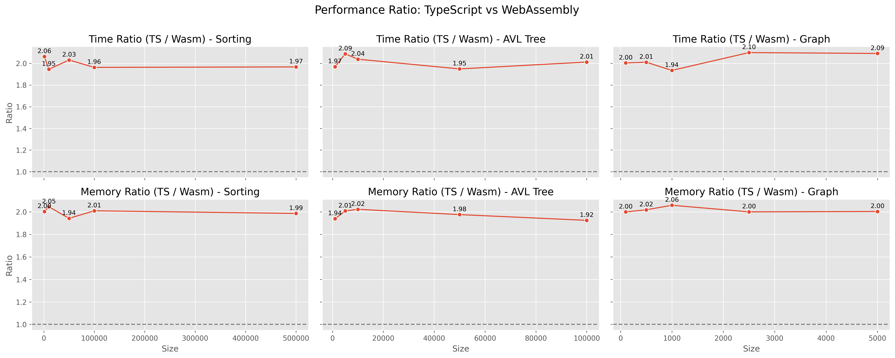
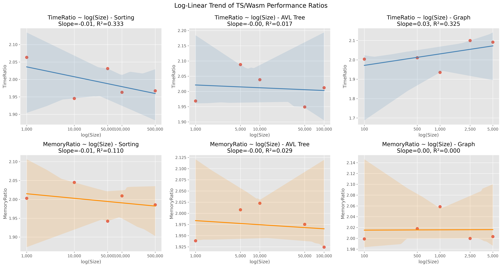

# TypeScript vs WebAssembly 性能比較

[[English](./README.en.md)], [[Japanese](./README.ja.md)], [[Zenn(Japanese)](https://zenn.dev/articles/39b82280a191d9)]

## 1. 概要（Abstract）

本研究では、WebAssembly（Wasm）とTypeScript（TS）による3種のアルゴリズム（配列ソート、AVL木挿入、単一始点最短経路）を実装し、ブラウザ環境においてそれぞれ1,000回ずつ実行した。結果として、**Wasmは常にTSより高速かつメモリ効率に優れており、最大で2.1倍の速度差と2倍のメモリ削減**を示した。log-linear回帰により、性能差は入力サイズによらず安定しており（傾き ≈ 0、決定係数 ≪ 0.01）、特に初期オーバーヘッドの小ささからWasmはリアルタイム処理に適していることが明らかとなった。また、性能を「初期コスト」と「漸化的コスト」に分解して解析し、用途に応じたランタイム選択の指針を示す。

## 2. 実験設定

* **アルゴリズム：**

  * 配列ソート：ランダム配列（1,000〜500,000）
  * AVL木：挿入処理（1,000〜100,000）
  * グラフ（Dijkstra）：ノード数100〜5,000の疎グラフ
* **繰り返し回数：** 各ケース1,000回実行
* **環境：** Linux 6.14.4‐arch1-2 (x86\_64), Chromium 135.0.7049.114 (64-bit)

## 3. 実験結果

### 3.1 実行時間とメモリ消費

**図1**：実行時間（ms）とメモリ使用量（MB）



* **ソート**：全サイズでWasmはTSより約2倍高速（例：1,000件で25.2ms vs 51.9ms）
* **AVL Tree**：5,000件で最大2.09倍の高速化
* **Graph**：2,500ノードで最大2.10倍の差

メモリ使用量も一貫してWasmが優位（平均2.5MB vs TSの5MB）

### 3.2 相対性能比

**図2**：TimeRatio および MemoryRatio



* 時間比：全ケースで1.9〜2.1に安定
* メモリ比：すべてのアルゴリズムで約2倍の効率

### 3.3 対数線形モデル

log(Size) に対する性能変化の回帰（表1・図3）

**表1**：各条件における傾きと決定係数

| 指標    | タスク      | 実装   | 傾き     | R²     |
| ----- | -------- | ---- | ------ | ------ |
| 実行時間  | Sorting  | TS   | -0.506 | 0.0014 |
| 実行時間  | Sorting  | Wasm | -0.100 | 0.0002 |
| 実行時間  | AVL Tree | TS   | +0.059 | 0      |
| 実行時間  | AVL Tree | Wasm | +0.076 | 0.0001 |
| 実行時間  | Graph    | TS   | +0.393 | 0.0003 |
| 実行時間  | Graph    | Wasm | -0.112 | 0.0001 |
| メモリ使用 | Sorting  | TS   | +0.007 | 0      |
| メモリ使用 | Sorting  | Wasm | +0.010 | 0.0002 |
| メモリ使用 | AVL Tree | TS   | -0.011 | 0      |
| メモリ使用 | AVL Tree | Wasm | -0.001 | 0      |
| メモリ使用 | Graph    | TS   | +0.033 | 0.0002 |
| メモリ使用 | Graph    | Wasm | +0.016 | 0.0002 |

*傾き ≈ 0、R² ≪ 0.01より、サイズによる性能劣化はほぼ見られない。*

**図3**: TS/Wasmパフォーマンス比率の対数線形モデル



* **TimeRatio（上段3グラフ）**：Sortingではわずかな負の傾向（スロープ=-0.01）で、サイズ増加によりTSとWasmの速度差がわずかに縮小。一方Graphでは正の傾向（スロープ=+0.03）となり、サイズ増加によりWasmの優位性がやや低下している可能性がある。ただしR²値はいずれも0.3程度以下であり、統計的には弱い傾向である。

* **MemoryRatio（下段3グラフ）**：全てのタスクにおいてスロープはほぼ0で、R²も0.1以下と極めて低いため、**Wasmのメモリ効率の高さはサイズにかかわらず安定している**。これは、Wasmが動的メモリ使用を最小限に保っていることを示唆する。

この結果から、WebAssemblyのスケーラビリティは非常に高く、初期コストと同様に漸化的コストも抑制されていることがわかる。

## 4. 考察：初期コスト vs 漸化的コスト

* **初期コスト：** WasmはTSの約半分 → リアルタイム処理に有利
* **漸化的コスト：** 両者ともほぼ0 → サイズ増加に対して安定

**用途別推奨ランタイム：**

| 処理タイプ     | 推奨環境         | 理由                   |
| --------- | ------------ | -------------------- |
| 即時応答処理    | ✅ Wasm       | 起動コストが小さく、即時性に優れる    |
| バッチ／長時間処理 | ⚪ 両方可        | どちらもスケーラブル、Wasmはやや高速 |
| 動的スクリプト実行 | ⚪ TypeScript | 実行時生成・型安全性に強み        |

## 5. 結論と再現手順

Wasmは常にTypeScriptより高速かつ効率的であり、初期起動も軽いためWebクライアントにおける実行基盤として有望である。

**再現手順：**

```bash
pnpm install && pnpm run start
open http://localhost:8080/benchmark.html
```
