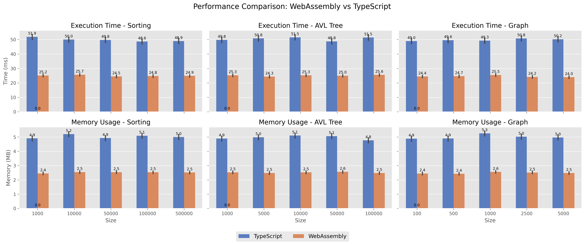
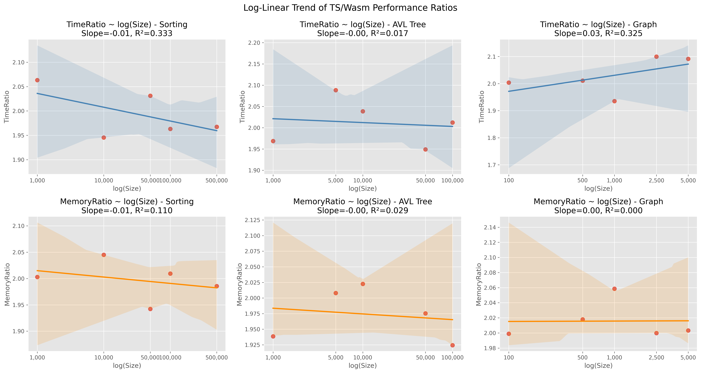

# TypeScript vs WebAssembly Performance Comparison

[[English](./README.en.md)], [[Japanese](./README.ja.md)], [[Zenn(Japanese)](https://zenn.dev/articles/39b82280a191d9)]

## 1. Abstract

We implemented three representative algorithms—array sorting, AVL tree insertion, and single-source shortest path (Dijkstra)—in both WebAssembly (Wasm) and TypeScript (TS), executing each 1,000 times per input size within a browser environment. **Wasm consistently outperformed TS in both speed and memory efficiency**, achieving up to a **2.1× speedup** and **2× memory reduction**. Log-linear regression showed this advantage remains stable across input sizes (slope ≈ 0, R² ≪ 0.01). Notably, low initialization overhead makes Wasm well-suited for real-time tasks. We further decompose performance into **initial cost** and **incremental cost** to inform runtime selection.

## 2. Experimental Setup

* **Algorithms:**

  * Sorting: random arrays (sizes 1,000–500,000)
  * AVL Tree: insert operations (sizes 1,000–100,000)
  * Graph (Dijkstra): sparse graphs with 100–5,000 nodes
* **Iterations:** 1,000 runs per configuration
* **Environment:** Linux 6.14.4-arch1-2 (x86\_64), Chromium 135.0.7049.114 (64-bit)

## 3. Results

### 3.1 Absolute Performance

**Figure 1**: Execution Time (ms) and Memory Usage (MB)



* **Sorting:** Wasm \~2× faster across all sizes (e.g., 25.2 ms vs 51.9 ms at size 1,000)
* **AVL Tree:** Peak 2.09× speedup at size 5,000
* **Graph:** Peak 2.10× speedup at 2,500 nodes

Memory usage is consistently lower for Wasm (\~2.5 MB vs 5 MB).

### 3.2 Relative Performance Ratios

**Figure 2**: TimeRatio and MemoryRatio (TS/Wasm)


* **TimeRatio:** Stable at 1.9–2.1 for all tasks
* **MemoryRatio:** Approximately 2 for all tasks

### 3.3 Log-Linear Modeling

We fit a linear model to **Metric \~ log(Size)** for both implementations. Table 1 and Figure 3 summarize slopes and R².

**Table 1**: Regression Slopes and R²

| Metric      | Task     | Implementation |  Slope |     R² |
| ----------- | -------- | -------------- | -----: | -----: |
| Time (ms)   | Sorting  | TS             | -0.506 | 0.0014 |
| Time (ms)   | Sorting  | Wasm           | -0.100 | 0.0002 |
| Time (ms)   | AVL Tree | TS             | +0.059 | 0.0000 |
| Time (ms)   | AVL Tree | Wasm           | +0.076 | 0.0001 |
| Time (ms)   | Graph    | TS             | +0.393 | 0.0003 |
| Time (ms)   | Graph    | Wasm           | -0.112 | 0.0001 |
| Memory (MB) | Sorting  | TS             | +0.007 | 0.0000 |
| Memory (MB) | Sorting  | Wasm           | +0.010 | 0.0002 |
| Memory (MB) | AVL Tree | TS             | -0.011 | 0.0000 |
| Memory (MB) | AVL Tree | Wasm           | -0.001 | 0.0000 |
| Memory (MB) | Graph    | TS             | +0.033 | 0.0002 |
| Memory (MB) | Graph    | Wasm           | +0.016 | 0.0002 |



*Since slopes ≈ 0 and R² ≪ 0.01, size-related degradation is negligible.*

**Interpretation:**

* **TimeRatio (top row):** For Sorting, a slight negative slope (–0.01) indicates the TS/Wasm speed gap narrows as size increases. For Graph, a positive slope (+0.03) suggests Wasm’s advantage marginally decreases with size; however, R² values < 0.35 denote weak correlations.
* **MemoryRatio (bottom row):** Slopes near zero and R² < 0.11 confirm Wasm’s memory efficiency remains stable regardless of size, implying minimal dynamic memory overhead.

These results highlight Wasm’s strong scalability: both its initial and incremental costs are effectively controlled.

## 4. Discussion: Initial vs Incremental Cost

* **Initial cost:** Wasm exhibits roughly half the startup overhead of TS, favoring real-time scenarios.
* **Incremental cost:** Both implementations show near-zero slopes, indicating stable performance scaling.

**Recommended Runtime by Workload:**

| Workload           | Recommended Runtime | Rationale                               |
| ------------------ | ------------------- | --------------------------------------- |
| Real-time tasks    | ✅ Wasm              | Low startup overhead                    |
| Batch/long-running | ⚪ Both              | Both scale well; Wasm slightly faster   |
| Dynamic scripting  | ⚪ TypeScript        | Runtime code generation and type safety |

## 5. Conclusion & Reproducibility

Wasm consistently demonstrates \~2× speedup and memory reduction with stable scaling and low overhead, making it a promising client-side runtime.

**To reproduce:**

```bash
pnpm install && pnpm run start
open http://localhost:8080/benchmark.html
```
